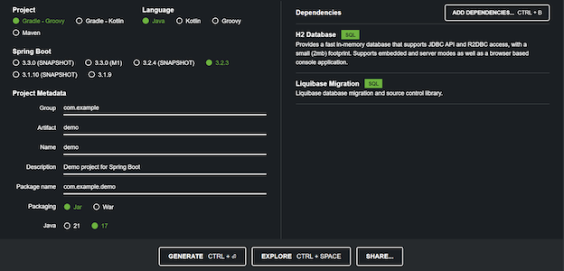

# Liquibase with Spring Boot and Gradle


The tutorial describes the use of Spring Boot with the Gradle project. To install Gradle and add it to your path, follow [Gradle releases](https://gradle.org/releases/).

!!! Note
    To use Spring Boot and Maven, see [Using Liquibase with Spring Boot and Maven Project](../using-springboot-with-maven).

## Create the project

To create the project, use [Spring Initializer](https://start.spring.io):

1.  Under **Project**, select **Gradle Project**.
2.  Select Java as your **Language**.
3.  Under **Spring Boot**, select 2.3.4.
4.  For **Packaging**, select **Jar**.
5.  Use version 17 or later for Java.

    After selecting your options, the project window needs to look similar to the screenshot:

    

6. Click **GENERATE** to download your project template as a `zip` file. Extract it and open in your IDE.


!!! Note
    Liquibase supports a variety of [commands](https://docs.liquibase.com/commands/home.html). For now, Spring Boot integrates the `update`, `future-rollback-sql`, `drop-all`, `update-testing-rollback`, and `clear-checksums` commands.

Spring Boot offers a subset of the Liquibase configuration options. In the table, the Spring Boot options are listed against the Liquibase options.

| Spring Boot&nbsp;&nbsp;&nbsp;&nbsp;&nbsp;&nbsp;&nbsp;&nbsp;&nbsp;&nbsp;&nbsp;&nbsp;&nbsp;&nbsp;&nbsp;&nbsp; | Liquibase&nbsp;&nbsp;&nbsp;&nbsp;&nbsp;&nbsp;&nbsp;&nbsp;&nbsp;&nbsp;&nbsp;&nbsp;&nbsp;&nbsp;&nbsp;&nbsp;&nbsp;&nbsp;&nbsp;&nbsp;&nbsp;&nbsp; | Description |
| ----------- | --------- | ----------- |
| `spring.liquibase.change-log` | `changelog-file` | changelog configuration path |
| `spring.liquibase.labels` | `labels` | Comma-separated list of runtime labels to use |
| `spring.liquibase.contexts` | `Contexts` | Comma-separated list of runtime contexts to use |
| `spring.liquibase.database-change-log-lock-table` | `databaseChangeLogLockTableName` | Name of table to use for tracking concurrent Liquibase usage |
| `spring.liquibase.database-change-log-table` | `databaseChangeLogTableName` | Name of table to use for tracking change history |
| `spring.liquibase.default-schema` | `defaultSchemaName` | Default database schema |
| `spring.liquibase.liquibase-schema` | `liquibaseSchemaName` | Schema to use for Liquibase objects |
| `spring.liquibase.liquibase-tablespace` | `databaseChangeLogTablespaceName` | Tablespace to use for Liquibase objects |
| `spring.liquibase.parameters.*` | `parameter.*` | changelog parameters |
| `spring.liquibase.password` | `password` | Login password of the database to migrate |
| `spring.liquibase.tag` | -- | Tag name to use when applying database changes. Can also be used with `rollbackFile` to generate a rollback script for all existing changes associated with that tag |
| `spring.liquibase.url` | `url` | JDBC URL of the database to migrate. If not set, the primary configured data source is used |
| `spring.liquibase.user` | `username` | Login user of the database to migrate |

## Configure Liquibase

To start using Liquibase and Spring Boot with Gradle:

1.  Open the existing Spring Boot `application.properties` file. To find the file, navigate to `src/main/resources/application.properties`.
2.  Add the following properties to run Liquibase migrations. Update the values depending on your database requirements:
    ```
    spring.datasource.url=jdbc:h2:~/liquibase;DB_CLOSE_ON_EXIT=FALSE
    spring.datasource.username=sa
    spring.datasource.password=
    spring.liquibase.change-log=classpath:db/changelog/db.changelog-master.xml
    ```
3.  Create a changelog file: `src/main/resources/db/changelog/db.changelog-master.xml`. Liquibase also supports the `.sql`, `.yaml`, or `.json` changelog formats. For more information, see [Introduction to Liquibase](https://docs.liquibase.com/concepts/introduction-to-liquibase.html) and [Getting Started with Liquibase](https://docs.liquibase.com/start/home.html).

    !!! Note
        If you use a different changelog format, you will need to update the `spring.liquibase.change-log` property with the updated filename.

4.  Add the following code snippet to your changelog file, including changesets:

    ```
    <?xml version="1.0" encoding="UTF-8"?>
    <databaseChangeLog
    xmlns="http://www.liquibase.org/xml/ns/dbchangelog"
    xmlns:xsi="http://www.w3.org/2001/XMLSchema-instance"
    xmlns:ext="http://www.liquibase.org/xml/ns/dbchangelog-ext"
    xmlns:pro="http://www.liquibase.org/xml/ns/pro"
    xsi:schemaLocation="http://www.liquibase.org/xml/ns/dbchangelog
    http://www.liquibase.org/xml/ns/dbchangelog/dbchangelog-latest.xsd
    http://www.liquibase.org/xml/ns/dbchangelog-ext http://www.liquibase.org/xml/ns/dbchangelog/dbchangelog-ext.xsd
    http://www.liquibase.org/xml/ns/pro http://www.liquibase.org/xml/ns/pro/liquibase-pro-latest.xsd">
    <changeSet id="202010211812" author="Julius Krah">
        <createTable tableName="house">
            <column name="id" type="bigint">
                <constraints primaryKey="true" primaryKeyName="house_id_pk" />
            </column>
            <column name="owner" type="varchar(250)">
                <constraints unique="true" uniqueConstraintName="house_owner_unq" />
            </column>
            <column name="fully_paid" type="boolean" defaultValueBoolean="false"></column>
        </createTable>
        <createTable tableName="item">
            <column name="id" type="bigint">
                <constraints primaryKey="true" primaryKeyName="item_id_pk" />
            </column>
            <column name="name" type="varchar(250)" />
            <column name="house_id" type="bigint">
                <constraints nullable="false" notNullConstraintName="item_house_id_nn" />
            </column>
        </createTable>
        <addAutoIncrement tableName="house" columnName="id" columnDataType="bigint" startWith="1" incrementBy="1" />
        <addAutoIncrement tableName="item" columnName="id" columnDataType="bigint" startWith="1" incrementBy="1" />
        <createSequence sequenceName="hibernate_sequence" incrementBy="1" startValue="1" />
        <addForeignKeyConstraint baseTableName="item" baseColumnNames="house_id" constraintName="item_house_id_fk" referencedTableName="house" referencedColumnNames="id" />
    </changeSet>
    </databaseChangeLog>
    ```

## Run Liquibase

5.  Run your migration with the following command:

    ```
    ./gradlew bootRun
    ```
    !!! Tip
        If you did not use Spring Initializr, you might not have the `gradlew` script in your project. In this case, run the following command:
    
        `gradle bootRun`
    
        Both `gradle` and `gradlew` create a Java `jar` for your application. The application `jar` is located in the `build/libs` directory of your Gradle project.
    
        You can execute the `jar` file by running `java -jar springbootProject-0.0.1-SNAPSHOT.jar`.

6. From a database UI tool, ensure that your database contains the `house` and `item` tables you added along with the [DATABASECHANGELOG table](https://docs.liquibase.com/concepts/tracking-tables/databasechangelog-table.html) and [DATABASECHANGELOGLOCK table](https://docs.liquibase.com/concepts/tracking-tables/databasechangeloglock-table.html).

Source code is available at [https://github.com/juliuskrah/spring-boot-liquibase](https://github.com/juliuskrah/spring-boot-liquibase).
